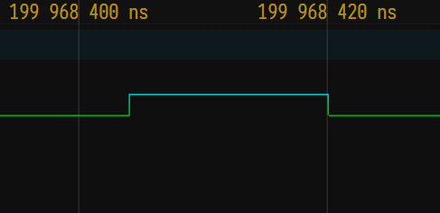

digitalWriteFast for RP2040
===========================

Found those 2 lines to speed pin toggling on an RP2040:

```
#define digitalWriteFast(pin,val) (val ? sio_hw->gpio_set = (1 << pin) : sio_hw->gpio_clr = (1 << pin))
#define digitalReadFast(pin) ((1 << pin) & sio_hw->gpio_in)
```

Timings
=======

Should be 16ns at default 120mhz speed.
Should be 8ns at default 240mhz speed. (untested)

Here is a capture of the ```speedtest.ino``` loaded into Wowki simulator, and
the VCD captured file loaded into ```https://vc.drom.io``` :



Links
=====

* VCD online visualisator: https://vc.drom.io
* Inspired from: https://academy.cba.mit.edu/classes/input_devices/step/hello.txrx2.RP2040.ino
* digitalWriteFast library (for AVR only): https://github.com/ArminJo/digitalWriteFast
